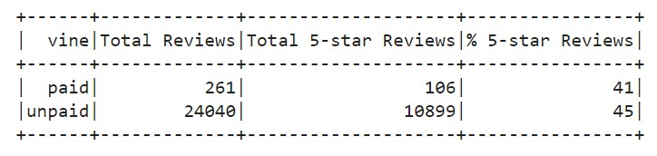

# Amazon_Vine_Analysis

## Project Overview 
BigMarket, a Startup that helps businesses optimize their marketing efforts. One of BigMarket’d Clients had requested some pretty hefty analytics. The client Sellby is about to release a large catalog of products on a leading retail website. They want to know how the reviews of their products compare to the reviews of similar products sold by their competitors. They are also interested in enrolling in a program that gives out free products to select reviewers, but they want to know if it’s worth the cost. SellBy wants to analyze the Amazon reviews written by members of the paid Amazon Vine program. The Amazon Vine program is a service that allows manufacturers and publishers to receive reviews for their products. Companies like SellBy pay a small fee to Amazon and provide products to Amazon Vine members, who are then required to publish a review. There are approximately 50 datasets from the Amazon Vine program. Each one contains reviews of a specific product, from clothing apparel to wireless products.

The purpose of this project is to pick one of these datasets and use PySpark to perform the ETL process to extract the dataset, transform the data, connect to an AWS RDS instance, and load the transformed data into pgAdmin. Next, using PySpark, Pandas, or SQL to determine if there is any bias toward favorable reviews from Vine members in your dataset. Then, write a summary of the analysis for Jennifer to submit to the SellBy stakeholders.

## Results
Vine Summary Dataframe: 

How many Vine reviews and non-Vine reviews were there?
> There were 261 Vine reviews and 24,040 non-Vine reviews. 

How many Vine reviews were 5 stars? How many non-Vine reviews were 5 stars?
> There were 106 Vine reviews were 5 stars and 10,899 non-Vine reviews were 5 stars.

What percentage of Vine reviews were 5 stars? What percentage of non-Vine reviews were 5 stars?
> There were 41% of Vine reviews were 5 stars and 45% of non-Vine reviews were 5 stars.

## Summary
There was no positivity bias for reviews in the Vine program. The percentage of non-Vine 5 stars reviews was 4% more than Vine 5 stars reviews.

An additional analysis that could be done with the dataset to support the statement: 
- Calculated the total number of reviews, the number of reviews per stars, and the percentage of reviews per stars for 1, 2, 3, and 4 stars reviews for all Vine and non-Vine reviews
- Change the Dataset and re-run the analysis. 

